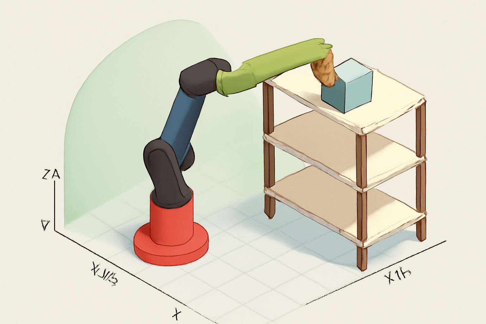

4-DOF RRPR Manipulator - Pick and Place Simulation
--------------------------------------------------

Overview
-------

This Python project simulates a 4-DOF RRPR (Revolute-Revolute-Prismatic-Revolute) robotic manipulator performing pick-and-place tasks with movable boxes. The simulator animates the robot, computes Forward Kinematics/Inverse Kinematics, shows end-effector trajectories, and displays interactive blue boxes being picked from the floor and placed on multi-slab shelves.



**Features:**

-   **4-DOF RRPR Kinematics:** Implements Forward Kinematics (FK) and a fast, constrained Inverse Kinematics (IK) solver (analytic **θ<sub>1</sub>** (yaw), **θ<sub>2</sub>** (pitch),  **d<sub>3</sub>** (telescopic prismatic extension),  **θ<sub>4</sub>** (wrist rotational alignment)). 

-   **Pick and Place Task Simulation:** The robot executes a sequence of pick-and-place tasks, moving boxes from the floor to specified shelf locations. 

-   **Dynamic Objects:** Simulated blue boxes are linked to the end-effector when **"grasped"** and snap accurately onto the shelf slabs when **"released"**. 

-   **Trajectory Visualization:** Displays the end-effector (EE) position and a fading trajectory line. 

-   **Scene Components:** Includes a floor grid, a shelf structure, and a moving status label.

Robot Configuration
-------------------

### Physical Parameters

python

```
L1 = 0.55 m        # Base vertical offset
L2 = 0.50 m        # Shoulder link length
TOOL_LEN = 0.12 m  # End-effector/tool length
BOX_SIZE = 0.07 m  # Box dimensions
```

### Joint Limits

| Joint | Type | Range | Description |
| --- | --- | --- | --- |
| θ₁ | Revolute | -π to π | Base rotation (azimuth) |
| θ₂ | Revolute | -π/2 to π/2 | Shoulder elevation |
| d₃ | Prismatic | -0.25 to 0.80 m | Linear extension |
| θ₄ | Revolute | -π to π | Tool pitch |

Installation
------------

### Requirements

bash

```
pip install numpy matplotlib
```

### Dependencies

-   Python 3.7+
-   NumPy
-   Matplotlib (with 3D support)

Usage
-----

### Run the Simulation

bash

```
python main.py
```

DH Parameter Table
------------------

| **Joint** | **α_(i-1)** (Link Twist) | **a_(i-1)** (Link Length) | **d_i** (Link Offset) | **θ_i** (Joint Angle) |
| --- | --- | --- | --- | --- |
| **1** | 0° | 0 | **L1** | **θ₁** |
| **2** | -90° | 0 | 0 | **θ₂** |
| **3** | 0° | **L2** | **d₃** | 0 |
| **4** | 0° | 0 | 0 | **θ₄** |

### DH Parameters:

-   **Joint 1 (Base Rotation)**: Rotation about the `z-axis` with a vertical offset `L1`.

-   **Joint 2 (Shoulder Elevation)**: Rotates around an axis perpendicular to the `z-axis` with an offset `L2`.

-   **Joint 3 (Prismatic Extension)**: The prismatic joint, which extends along the `z-axis` with displacement `d3`.

-   **Joint 4 (Tool Pitch)**: Rotates the tool to control its orientation with respect to the previous link.

The DH transformations are used to calculate the end-effector position at each step.

### Coordinate Frames

-   Frame 0: Base frame at ground level
-   Frame 1: After base rotation at height L1
-   Frame 2: After shoulder elevation
-   Frame 3: Wrist position after prismatic extension
-   Frame 4: Tool tip (end-effector)

 * * * * * 
Algorithm Breakdown
-------------------

### Step 1: **Compute Wrist Position**

`wrist_z = z_tip + TOOL_LEN`

-   Assumes the tool points straight down (vertical, `-z` direction).

-   Back-calculates the **wrist position (P3)** by subtracting the **tool length** from the tool tip's `z` coordinate (`z_tip`).

### Step 2: **Solve for θ₂ (Shoulder Elevation)**

`s = (wrist_z - L1) / L2
theta2 = asin(s)`

-  From the geometry, the **vertical reach** is given by:

$$
z_{\text{wrist}} = L1 + L2 \cdot \sin(\theta_2)
$$

- Rearranging for \(\theta_2\):

$$
\theta_2 = \arcsin\left(\frac{z_{\text{wrist}} - L1}{L2}\right)
$$

- The value is clipped between `-1` and `1` to ensure valid values for `sin(θ2)`.

### Step 3: **Solve for d₃ (Prismatic Extension)**

`r = hypot(x, y)  # radial distance from z-axis

-   The total radial reach is the sum of the arm's reach (`L2 * cos(θ2)`) and the prismatic displacement `d3`.

$$
d_3 = r - L2 \cdot \cos(\theta_2)
$$
-   The value of `d3` is then clipped within the limits of the prismatic joint, i.e., between `D3_MIN` and `D3_MAX`.

### Step 4: **Solve for θ₁ (Base Rotation)**

`theta1 = atan2(y, x)`

-   The `x` and `y` coordinates of the end-effector give the direction for `θ1`.

-   `arctan2` computes the angle between the `x` and `y` coordinates, ensuring the correct quadrant.

-   The value of `θ1` is clipped to the range `[THETA1_MIN, THETA1_MAX]`.

### Step 5: **Solve for θ₄ (Tool Pitch)**

`theta4 = -pi/2 - theta2`

-   This enforces the combined angle `elev = θ2 + θ4 = -π/2`, ensuring that the tool remains **perpendicular** to the horizontal plane (straight down).

### Step 6: **Verification**

`P4, _ = fk_full(joint)
if np.linalg.norm(P4 - np.array([x, y, z_tip])) > IK_TOL:
    raise ValueError(f"IK residual too large: {np.linalg.norm(P4 - np.array([x, y, z_tip]))}")`

-   After computing the joint configurations (`θ1`, `θ2`, `d3`, `θ4`), we verify that the calculated end-effector position (`P4`) matches the target position (`tool_tip`) within a specified tolerance (`IK_TOL`).

* * * * *

Geometric Interpretation
------------------------

The robot operates similarly to a **vertical SCARA** variant with the following behavior:

1.  **θ₁**: Rotates the base to orient toward the target.

2.  **θ₂**: Controls the **vertical height** by elevating the shoulder.

3.  **d₃**: The prismatic joint extends or retracts to adjust the **radial distance** from the base to the target.

4.  **θ₄**: The tool pitch adjusts to keep the **end effector** oriented correctly, ensuring it points straight down relative to the rest of the arm.

The robot operates in **cylindrical coordinates**, with **radial** and **vertical** positioning controlled by `θ1` and `θ2`, respectively, and **reach** being extended by `d3`.

* * * * *

Animation
---------

The animation visualizes the robot's movements through a series of **pick-and-place tasks**:

1.  **Pick**: The robot moves from the home position to the object's current position on the floor.

2.  **Place**: The robot then moves from the pick position to one of the shelf positions and places the object there.

3.  The animation smoothly transitions through the robot's movements using **forward kinematics** and **inverse kinematics** for each task.

### Animation Details:

-   **Floor Grid**: A grid representing the floor area where objects are placed.

-   **Shelf**: A 3D rectangular shelf with multiple levels where objects are placed.

-   **Boxes**: Boxes are picked up and placed by the robot on the shelves.

-   **End-Effector**: The robot's end-effector moves along the trajectory defined by the joint configurations.

Future Enhancements
-------------------

-   **Inverse Kinematics Solver**: Extend the inverse kinematics solver to handle more complex manipulations or ambiguous solutions (e.g., elbow-up vs elbow-down).

-   **Path Planning**: Implement path planning algorithms for optimized movements.

-   **Collision Avoidance**: Add obstacle detection and avoidance in the robot's workspace.

-   **Force Control**: Implement force sensors and feedback to ensure secure grasping and placing of objects.

Conclusion
----------

This simulation effectively demonstrates the movement and task completion of a **4-DOF robotic manipulator** using forward and inverse kinematics. The **DH parameterization** provides a solid foundation for modeling and controlling the robot's movement. The **3D animation** offers a dynamic and intuitive way to visualize the robot's actions in a simulated environment.

The simulation accounts for:

-   Joint movements and constraints.

-   Grasping and releasing objects using inverse kinematics.

-   Displaying continuous motion and robot trajectory.

This project provides a foundation for understanding and simulating robotic manipulator movements using kinematics, suitable for further development and real-world applications in robotics and automation.

**GitHub Repository**

Full Project source code: <https://github.com/Erum330/Erum330-Robot_Manipulation_FinalCW.git> 

**Presentation Link**

Youtube Link: <https://youtu.be/KLkvBw9fX24>


